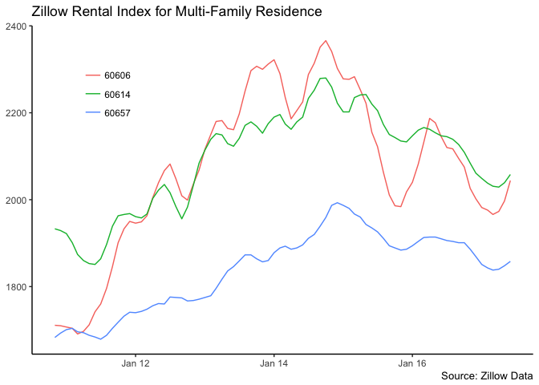

<!-- README.md is generated from README.Rmd. Please edit that file -->
About `zillowdata`
==================

The repo contains R scripts (in the [`data-raw` folder](https://github.com/jjchern/zillowdata/tree/master/data-raw)) that download and process a few zipcode-level datasets from [Zillow](https://www.zillow.com/research/data/). The datasets are stored in the [`data` folder](https://github.com/jjchern/zillowdata/tree/master/data).

Installation
============

``` r
# install.packages("devtools")
devtools::install_github("jjchern/zillowdata")

# To uninstall the package, use:
# remove.packages("zillowdata")
```

Usage
=====

``` r
library(tidyverse)

zillowdata::Zip_Zri_MultiFamilyResidenceRental %>% 
    filter(RegionName %in% c("60606", "60657", "60614")) %>% 
    mutate(YearMonth = paste0(YearMonth, "-01")) %>% 
    mutate(YearMonth = as.Date(YearMonth)) %>% 
    ggplot(aes(x = YearMonth, y = Zri, colour = RegionName)) +
    geom_line() +
    scale_x_date(date_labels = "%b %y") +
    labs(x = NULL, y = NULL,
         title = "Zillow Rental Index for Multi-Family Residence",
         caption = "Source: Zillow Data") +
    theme_classic() +
    theme(legend.position = c(0.15, 0.8),
          legend.title = element_blank())
```


